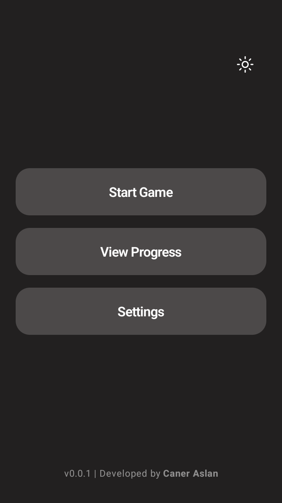
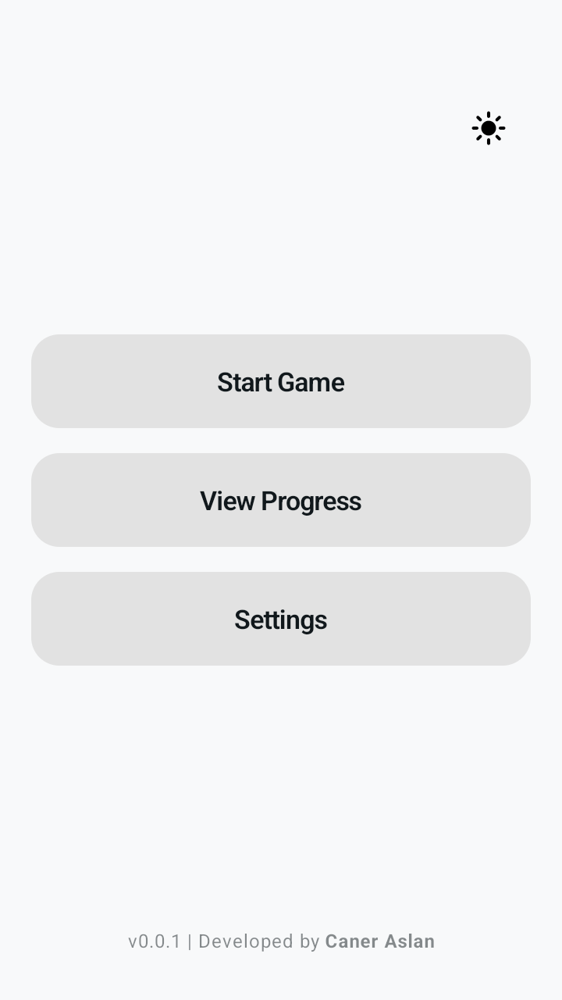
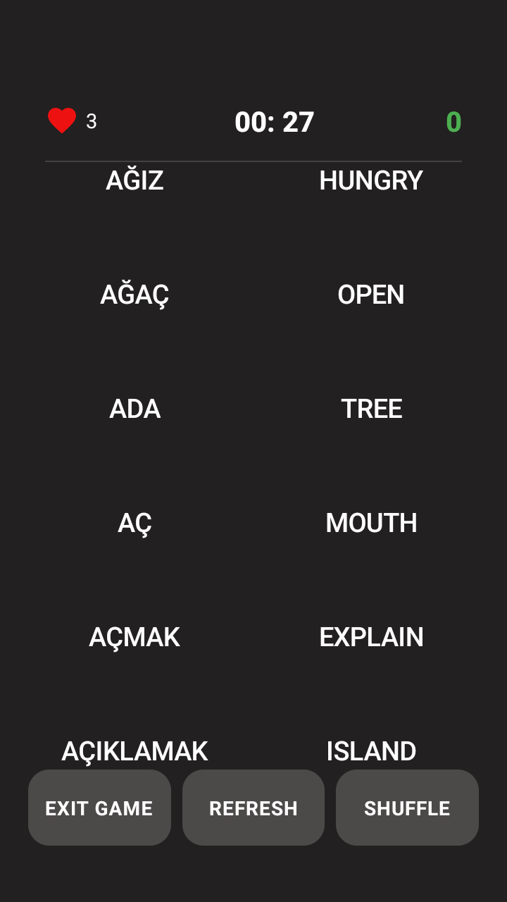
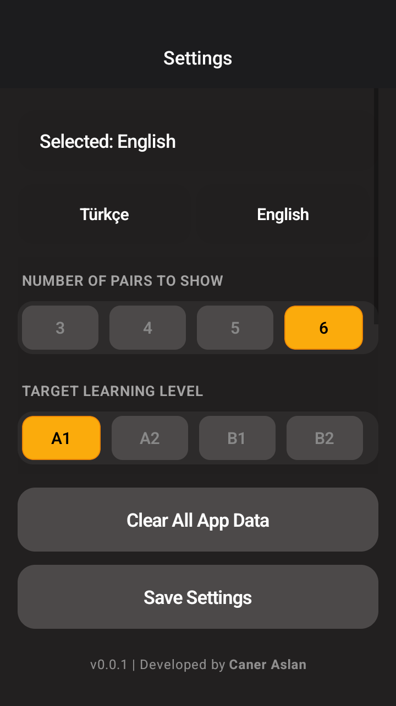

# Learn-English-App
A cross-platform mobile application for learning English vocabulary through interactive word-matching exercises. Built with React Native, Expo, and TypeScript.

# English Learn With Words 🚀

**English Learn With Words**, kullanıcıların İngilizce kelime dağarcığını interaktif ve eğlenceli bir şekilde geliştirmeleri için tasarlanmış bir mobil uygulamadır. Kelime eşleştirme mekanikleri ve kullanıcı dostu arayüzü ile dil öğrenme sürecini bir oyun deneyimine dönüştürür.

---

## ✨ Özellikler

* **İnteraktif Kelime Eşleştirme:** Kelimeleri anlamlarıyla eşleştirerek öğrenmeyi kalıcı hale getiren oyun yapısı.
* **Çoklu Dil Desteği:** Farklı dillerden İngilizceye kelime öğrenme imkanı.
* **Geniş Kelime Havuzu:** En yaygın kullanılan 2000'den fazla kelimeyi içeren kapsamlı bir veri seti.
* **Kullanıcı Dostu Arayüz:** Sade, modern ve hızlı bir UI deneyimi.
* **Çevrimdışı Çalışma:** İnternet bağlantısı olmadan da pratik yapabilme özelliği.

---

## 📸 Ekran Görüntüleri (Screenshots)

> Uygulamanın arayüzüne dair görseller aşağıdadır:

| Ana Ekran | Tema | Eşleştirme Modu | Ayarlar |
| :---: | :---: | :---: | :---: |
|  |  |  |  

---

## 🛠️ Kullanılan Teknolojiler

Bu uygulama modern mobil geliştirme araçları kullanılarak inşa edilmiştir:

* **React Native / Expo:** Cross-platform (iOS & Android) geliştirme için.
* **TypeScript:** Daha güvenli ve sürdürülebilir bir kod yapısı için.
* **AsyncStorage:** Yerel veri saklama ve kullanıcı ilerlemesini kaydetmek için.
